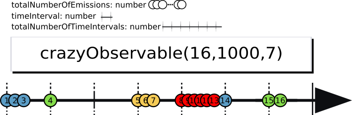

# crazyObservable

crazyObservable is a custom [RxJS](https://rxjs-dev.firebaseapp.com/) observable that act as a blueprint for streams of random emissions, that is, streams drawn from *all possibilities* of emmiting a *predefined number of data* over a predefined number of time steps (see [Marble diagram] bellow). This observable is intended to give a better approach to tackle problems like described in the following questions:

  * https://stackoverflow.com/questions/35060681/rxjs-how-can-i-generate-a-stream-of-numbers-at-random-intervals-within-a-speci
  * https://stackoverflow.com/questions/41628268/observable-that-delays-a-random-time-everytime-the-stream-ends/41632041#41632041
  * https://stackoverflow.com/questions/41388199/how-to-create-an-infinite-observable-that-produces-random-numbers-at-random-inte/41393512
  
## Marble diagram

 The following Marble diagram shows a possible datastream obtained by a subscription to crazyObservable(16, 1000, 7) where 16 is the totalNumberOfEmissions, 1000 is the timeInterval (in milliseconds) and 7 is the totalNumberOfTimeIntervals.



## Code example

The following code gives an example of how to use crazyObservables. Be sure to import [discreteRandomAssignment.js](./discreteRandomAssignment.js) to use crazyObservable.

```
var oneHourRandomTenHundredRequisition$ = crazyObservable(10000, 1000, 60 * 60);
// crazyObservable( totalNumberOfEmissions, timeInterval (miliseconds), totalNumberOfTimeIntervals )

let testComponent1 = oneHourRandomTenHundredRequisition$.subscribe({
next() { console.log("That's up to you!"); } ,
error() { console.log("An error have been encountered."); },
complete() { console.log("crazyObservable is garanteed to complete, unless your custom next() return an error}
});
```

## Proof

I will soon upload a for crazyObservable validity that relies in the *discrete random assignment* implemented [here](./discreteRandomAssignment.js). I am also up to refactoring this code to serve as a singleton service for Angular apps as soon as possible.

Note that calculations are done asyncronously and the number of emissions at each timestep is calculation on-the-fly.


  
